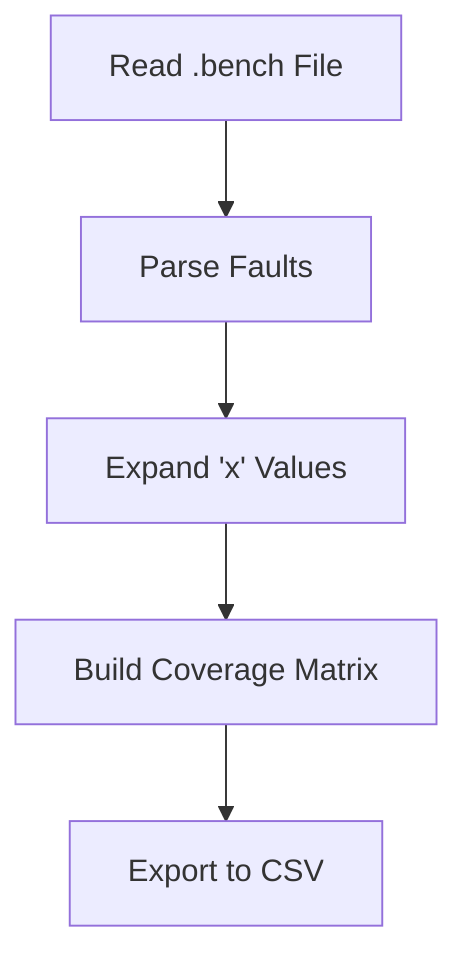
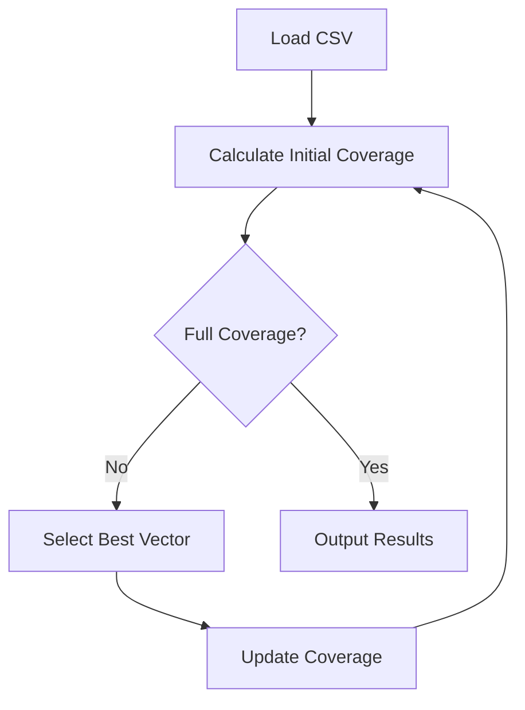
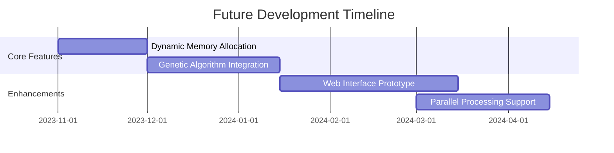

# 🔌 Digital Circuit Fault Analysis Toolkit (Student Project_Ferdowsi University)

A C-based system for analyzing test vectors and fault coverage in digital circuits. Developed as an academic project for VLSI testing concepts.

## 🌟 Features

### `fault_table.c` 🗂️
- 📖 Processes circuit description files (`.bench` format)
- 🔄 Expands 'x' (don't-care) values in test vectors
- 📊 Generates fault coverage matrix
- 💾 Exports results to CSV format

### `process.c` ⚙️
- 🎯 Greedy test vector selection algorithm
- 📈 Fault coverage calculation
- 🔄 Iterative coverage improvement
- 📉 Progress tracking through console output

## 📋 Requirements

- GCC compiler
- UNIX-like environment (Linux/macOS/WSL)
- Basic understanding of digital circuit testing

## 🚀 Quick Start

1. **Compile the Programs**
   ```bash
   gcc fault_table.c -o fault_table
   gcc process.c -o process
   ```

2. **Generate Fault Table**
   ```bash
   ./fault_table cut_ext3.bench
   ```

3. **Process Coverage Data**
   ```bash
   ./process fault_table.csv
   ```

## 📂 File Descriptions

| File               | Purpose                                                      |
|--------------------|-------------------------------------------------------------|
| `fault_table.c`    | Converts circuit description to fault coverage matrix       |
| `process.c`        | Implements test vector selection algorithm                  |
| `cut_ext3.bench`   | Example circuit description (input format)                  |
| `fault_table.csv`  | Generated output file showing fault/test vector relationships |

## 🧮 Key Algorithms

### Fault Table Generation (`fault_table.c`)


### Test Vector Selection (`process.c`)


## 🛠️ Usage Example

1. **Generate Fault Table**
   ```bash
   $ ./fault_table cut_ext3.bench
   Created fault_table.csv with 24 test vectors and 38 faults
   ```

2. **Analyze Coverage**
   ```bash
   $ ./process fault_table.csv
   Selected vectors: 111, x01, 001...
   Final coverage: 98.7%
   ```

## ⚠️ Known Limitations

- 🔒 Fixed array sizes limit input scalability
- ⏳ Basic greedy algorithm may not find optimal solutions
- 🧩 Limited error handling for malformed inputs
- 📏 Maximum 40 columns in process.c (defined by MAX_COLS)

## 📚 Academic Context

This project demonstrates:
- Fault modeling in digital circuits
- Test vector generation techniques
- Coverage analysis fundamentals
- Heuristic optimization approaches

## 📝 Project Structure

```
.
├── fault_table.c     # Coverage matrix generator
├── process.c         # Vector selection algorithm
├── cut_ext3.bench    # Sample circuit description
└── fault_table.csv   # Generated output file
```

## 🚧 Potential Improvements

1. Implement dynamic memory allocation
2. Add support for larger input files
3. Implement multiple heuristic algorithms
4. Add graphical coverage visualization
5. Improve error handling and input validation

## 📌 Important Notes

- The 'x' character represents don't-care conditions
- Output CSV uses 'x' to mark detected faults
- Test vectors are ranked by their fault coverage
- Maximum 10 iterations in the selection process

## 🤝 Contribution Guidelines

This is a student project - contributions are welcome through:
1. Bug reports
2. Algorithm improvements
3. Documentation enhancements
4. Test case additions

# 🔌 Digital Circuit Fault Analysis Toolkit (Continued)

## 🧩 Core Function Deep Dive

### `fault_table.c` Key Functions

1. **`replace_x()` Recursive Expansion**
```c
void replace_x(char *s, int index, char **result, int *count, int *capacity) {
    // Recursively replaces 'x' with 0/1 combinations
    // Example: "x01" → "001", "101"
    if (s[index] == '\0') {
        result[*count] = strdup(s);
        (*count)++;
        return;
    }
    if (s[index] == 'x') {
        s[index] = '0';
        replace_x(...);  // Left branch
        s[index] = '1';
        replace_x(...);  // Right branch
        s[index] = 'x';  // Backtrack
    }
}
```

2. **Fault Matrix Construction**
```c
// Builds coverage matrix by comparing expanded vectors
for (each unique vector) {
    printf("%-6s", vector);
    for (each fault) {
        printf("%-6s", vector_in_fault() ? "x" : "");
    }
}
```

### `process.c` Algorithm Logic

**Greedy Selection Pseudocode**
```
1. Initialize coverage matrix
2. While coverage < 100% and iterations < 10:
   a. Select vector with maximum uncovered faults
   b. Mark covered faults
   c. Update coverage statistics
3. Output optimal vector sequence
```

## 📐 Input/Output Specifications

### Input Format (`cut_ext3.bench`)
```plaintext
* Primary inputs: A B C
* Test patterns:
  C /1
      1: 111 001  # Format: [Fault Name] [Test Vectors]
  B->v /1
      1: x01 111
```

### Output Matrix (`fault_table.csv`)
```csv
TestVector,eBv1,eZ0,eY1...
111,x,x,,x...
x01,,x,x,x...
001,x,,x...
```

## 🧪 Testing Methodology

1. **Verification Test**
```bash
# Validate with sample input
$ ./fault_table sample.bench
$ head -n 5 fault_table.csv
TestVector,fault1,fault2,fault3
111,x,x,x
001,,x,
x01,x,,x
```

2. **Coverage Progress Check**
```bash
$ ./process fault_table.csv
Iteration 1: Selected 111 → Coverage 45%
Iteration 2: Selected x01 → Coverage 78%
...
```

## 🎓 Academic Relevance

This project implements concepts from:
1. **VLSI Testing Fundamentals**  
   - Fault modeling (stuck-at-0/1)
   - Test compaction techniques

2. **Combinatorial Optimization**  
   - NP-Hard problem demonstration
   - Greedy heuristic approach

3. **Digital Logic Concepts**  
   - Don't-care (x) handling
   - Fault propagation analysis

## 🐛 Common Issues & Solutions

| Issue | Solution |
|-------|----------|
| "Segmentation fault" | Check input file formatting |
| Missing vectors | Verify 'x' expansion logic |
| Low coverage | Increase MAX_COLS in process.c |
| File not found | Use absolute paths for input files |

## 📚 Recommended Reading

1. *Essentials of Electronic Testing* - M. Bushnell
2. *Digital Systems Testing and Testable Design* - M. Abramovici
3. *Introduction to Algorithms* (Greedy Methods Chapter) - CLRS

## 🌐 Project Roadmap



## 💻 Development Tips

1. **Debugging Memory Issues**
```bash
valgrind --leak-check=full ./fault_table input.bench
```

2. **Performance Profiling**
```bash
gprof ./process gmon.out > analysis.txt
```

3. **Code Formatting**
```bash
clang-format -i *.c  # Maintain consistent style
```
